# Simplified-OS

## Table of Contents
- [Introduction](#About)
- [Phase1 (Scheduler)](#Phase-1)
- [Phase2 (Memory Allocation)](#Phase-2)
- [Phase3 (Synchronization)](#Phase-3)
- [Examples and demos](#examples)
  * [Phase 1&2](#phase1&2)
  * [Phase 3](#Phase3)

## About
Simplified OS is a project that implements some algorithms used by an operating system kernel to achieve the jobs of scheduling processes, synchronization of processes through implementing the producer-consumer problem and memory allocation using the buddy system which is a dynamic partitioning algorithm. The project is divided into three phases:
## [Phase 1](/Phase1):
Includes implementing a process generator and an emulation of a clock to simulate the generation of processes in a system, then implementing a scheduler that is responsible for receiving processes at their arrival time and scheduling them using one of three scheduling algorithms taken as input from the user at the start of the program. The three algorithms implemented are:
- Non Pre-emptive Highest Priority first (HPF)
- Shortest Remaining time next (SRTN)
- Round-Rubin (RR)
## [Phase 2](/Phase2):
It extends phase 1 to add memory capabilities to the system. The following assumptions are considered:
- The memory size is 1024 bytes.
- No process needs memory larger than 256 bytes.
- The memory needed by processes is constant over the life time of the process in the system.
- simple uni-core CPU.

Now processes should be allocated in memory whenever they arrive and deallocated when leaving using the buddy algorithm. If a process cannot be allocated in memory on arrival it is added to a waiting queue till it can be allocated once more following the first come first serve criteria where the process that failed to allocate first will be the first process to be allocated in memory when there is enough space even if there are more processes waiting in the queue with smaller size. This was done for simplifying the process. However, the more efficient technique is to search the waiting queue for the process that can enter the system whenever space is available.
## [Phase 3](/Phase3):
It is independent of the previous two phases as it focuses more on the synchronization problem by implementing the producer consumer problem with multiple consumers and producers allowed at the same time

## Examples:
### Phase1&2: 
#### Input file:
[process_docs.txt](Phase2/testcases/processes_doc.txt)
#### Run details:
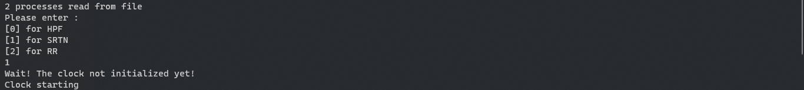
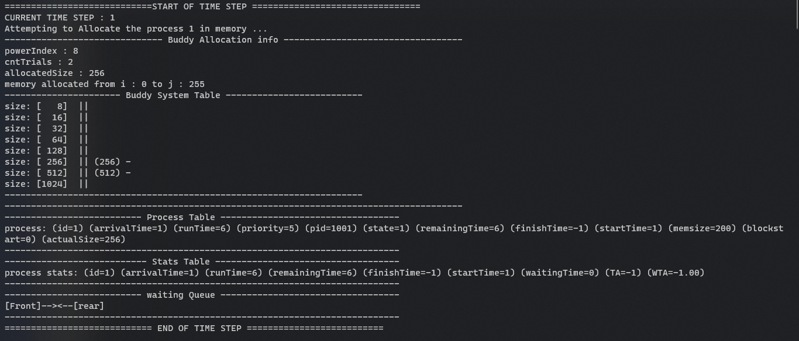
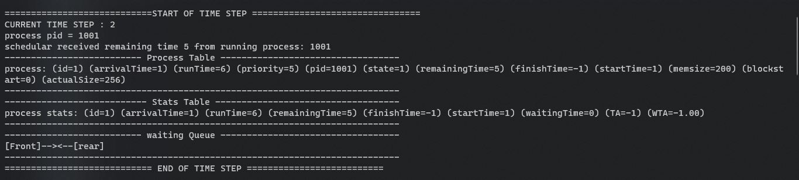
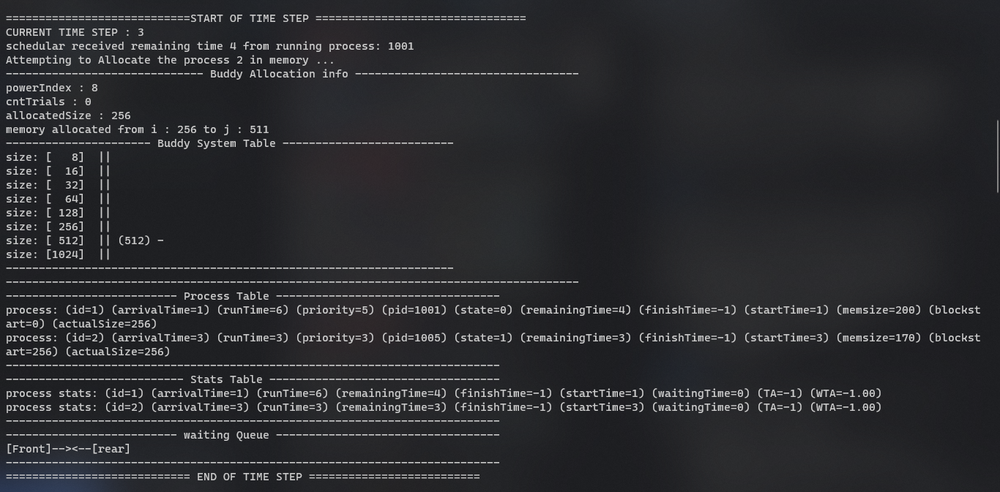
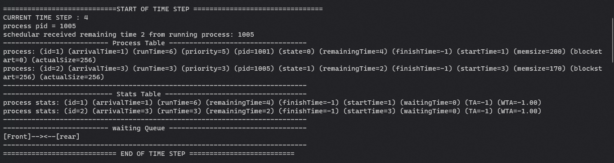
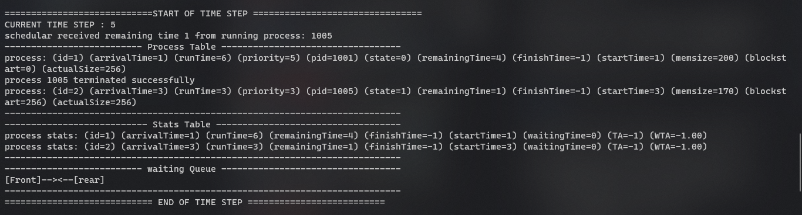
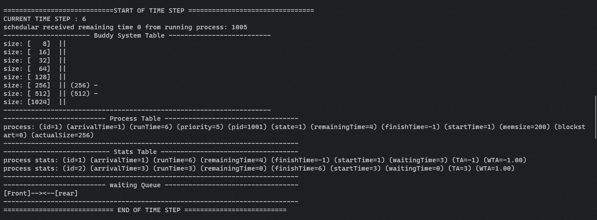
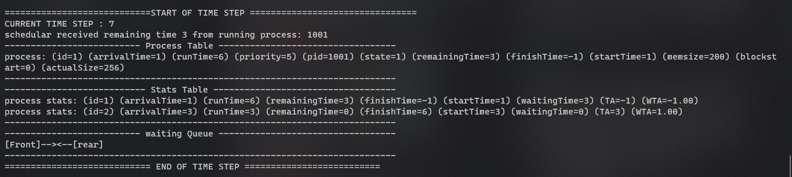
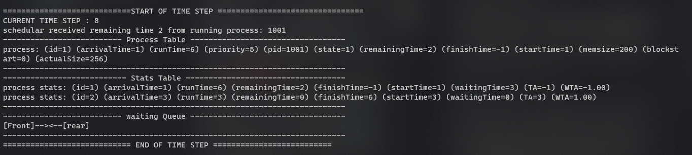
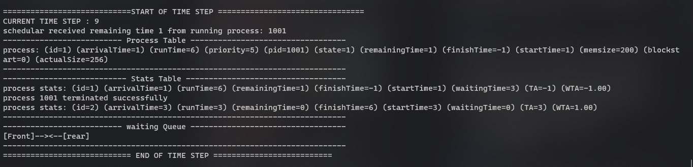
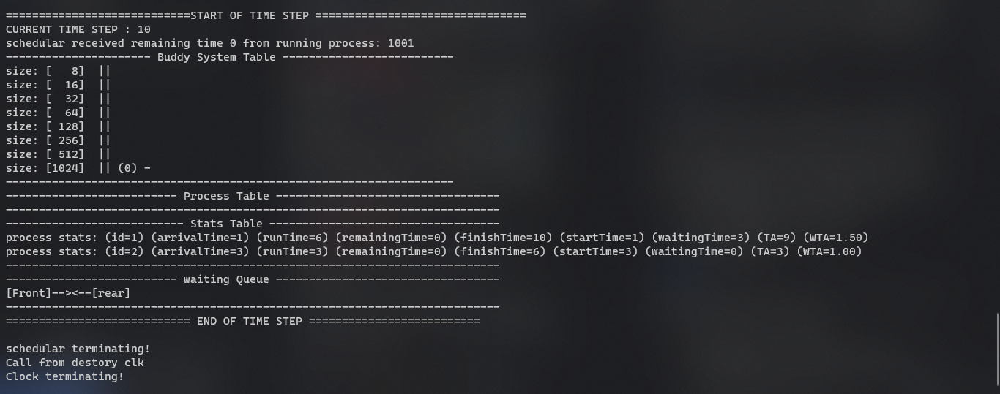
#### Output files & statistics:
- scheduler log:

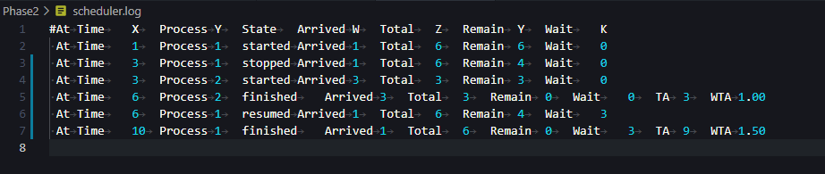

- memory log:

- statistics:

### Phase3: 

you can change the buffer size from `headers.h` file using the constant variable `BUFFER_SIZE` also to simulate different situations of different speed producers/consumers you can put `sleep(integer time in seconds)` at the end of the loop.

* Note: in our implementation of the circular queue the buffer index is reset to 0 when the buffer is empty so producer will always write on index 0 in case of fast consumer.

## Contributers:
- [Hossam Alaa](https://github.com/hossamalaa69)
- [Muhammed Ahmad Hesham](https://github.com/Etshawy1)
- [Muhammed Alaa](https://github.com/MuhammeedAlaa)
- [Mahmoud Gody](https://github.com/Moodrammer)

